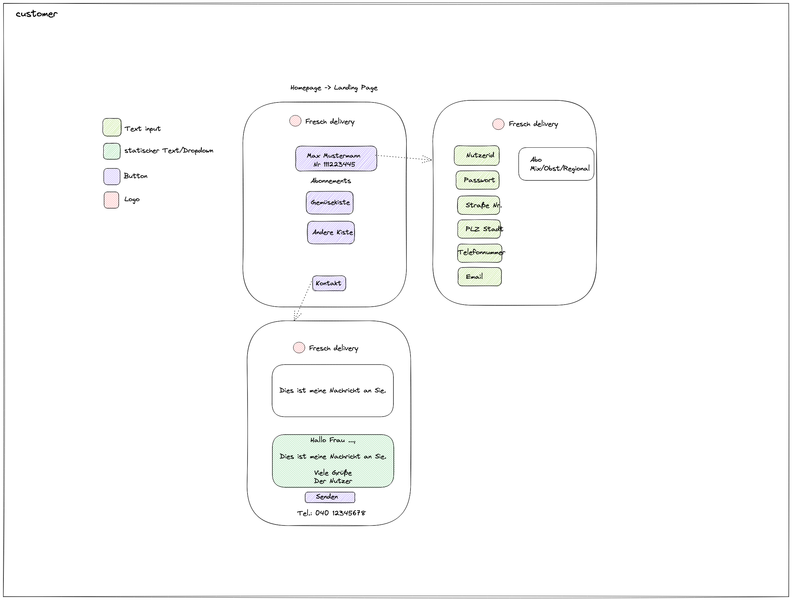

# biokiste
Backend 
 

Frontend 
## Teaser
The Biokiste App will add the functionality that organic box subscribers miss for most organic box deliveries in Germany: Manage an get updates on the subscription.

## Usage

## Installation

### Web
Open the web frontend [here](https://biokiste.herokuapp.com/).

### iOS and Android
only by hand possible. See Development.

## Development

### Drawings
Most up to date at [Excalidraw](https://excalidraw.com/#json=s9IsmlYfdRogrS1eNLObL,3vjggi8Ya3kXuSB4HHUE4Q).
 and/or [clickable at figma](https://www.figma.com/file/Ysrx9lh0R2de59mFTg4TeT/Biokiste?node-id=7%3A21)

### Repository and Deployment
- Tickets, Code repository and Pipelines are hosted at [Github biokiste.](https://github.com/Boltzmann/biokiste)
- Web deployment of front- and backend at [heroku](https://dashboard.heroku.com/apps/biokiste/deploy/heroku-git).
- The database is deployed on [Apache Atlas](https://cloud.mongodb.com).
- For Hybrid native support for Android and iOS [Ionic React](https://ionicframework.com/docs/react) is used. The Apps are deployed in the testing environments of Google Play and Testflight for iOS App Store.

#### iOS Deployment and Android deployment
see docs/dev-setup.md

### Setup
For development [node.js](https://nodejs.org/en/), 
[Java OpenJDK >= 11](https://openjdk.java.net/projects/jdk/11/), 
and [Docker](https://www.docker.com/) are needed.

To get started (with Intellij Ultimate):
1. Clone the project from Github.
2. Load the Maven project in Intellij.
3. ``npm install -g @ionic/cli``.
4. In the frontend folder, use ``npm install``.

Happy Hacking!

### Hints
[Color encodings](https://coolors.co/306b34-d3b88c-482728-5ef38c-78a1bb)

### Code Ownership/Maintainer
[Stefan Bollmann](mailto:stefan.bollmann@rwth-aachen.de)

# Credits
This project was made in a bootcamp by [neuefische](https://www.neuefische.de). There are several colleagues that helped to start this "capstone" project by discussion, reviews or help in other ways. Thank you.

If you - however - helped and want to see your name here or do not, tell Stefan.

# Intellectual Property / Copyright
Copyright 2022, Tristan Koch and Stefan Bollmann. All Rights Reserved. 

Unauthorized copying of the code, logos, designs, and the idea is strictly prohibited proprietary and confidential. Written by [Stefan Bollmann](mailto:stefan.bollmann@rwth-aachen.de), May 2022.
