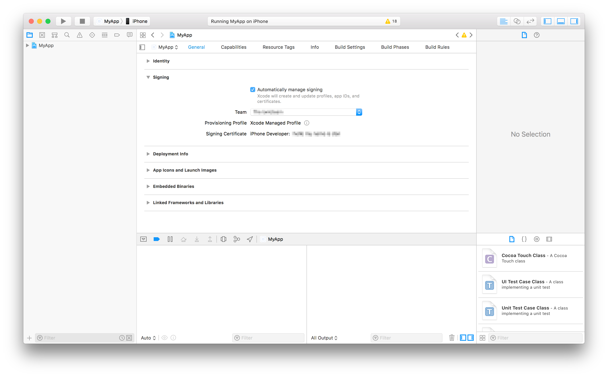

# Set up MongoDB locally
## Load and Start MongoDB
```
docker pull mongo
docker run --name mongo -p 27017:27017 -d mongo:latest
```
## Fill DB with first data
1. Add new database to MongoDB
   1. Connect to mongo instance. `docker exec -it mongo bash` and `mongosh`.
   2. Name it biokisteDB. `use biokisteDB` 
   3. Add at least one collection "organicBox" by importing in the collection organicBox.json from "/docs/test-resources/organicBox.json" `db.organicBox.insertMany(<content of json>)`
   4. You may add new collections analog to step 3 by importing the jsons from test-resources into respective collections.

# iOS and Android deployment (outdated)
This documentation is a work in progress. There can be wrong ways and missing steps.
A good help is the [ionic documentation](https://ionicframework.com/docs/react/your-first-app/deploying-mobile).
## Changes
To see changes in the code on a smartphone, do in the biokiste-app folder:
```
ionic build
ionic cap copy
```
and if a plugin was changed or added also a 
```
ionic cap sync
```
## iOS
### Start the app in XCode
To start the app on a  simulator or on an iOS device use
```
ionic capacitor run ios -l --external
```
There select your device and run it.
### Prerequisites
#### XCode signing

#### M1 processor
To run the project on iOS one can follow the path described as 
[2021 path on stackoverflow](https://stackoverflow.com/a/65334677/1985423). The steps 
described there follow below as STEP 1 and STEP 2. To be able to use them, the system 
ruby version needs to be used, [node 18 will not work (2002/05), so use e.g. node 16.15.0 instead.](https://github.com/ionic-team/ionic-cli/issues/4839)
```
# STEP 0: 
# a. Get sure that the system brew is used.
% which brew
/opt/homebrew/bin/brew
% brew uninstall ruby
% brew uninstall cocoapods
# b. Do not use node 18
% which node
/Users/stefan/.nvm/versions/node/v18.xx.x/bin/node
% nvm use v16.15.0
Now using node v16.15.0 (npm v8.5.5)
```
[Now simulate intel processor environment.](https://www.angularfix.com/2022/01/ionic-application-xcode-build-errors.html)
```
# STEP 1: Install ffi
sudo arch -x86_64 gem install ffi

# STEP 2: Re-install dependencies
arch -x86_64 pod install
```
[STEP 3 is setting the signature in XCode](Set a package ID e.g. "de.piphi.biokiste". Follow the instructions).
> In the same project editor, under the Signing section, ensure Automatically manage signing is 
> enabled. Then, select a Development Team. Given a Development Team, Xcode will attempt to 
> automatically prepare provisioning and signing.

## Android
```
ionic cap open android
```

## Links
### iOS
[iOS ionic](https://ionicframework.com/docs/developing/ios) with
```
xcode-select --install
```
Also use
```
sudo gem install cocoapods
```
and followed again the instructions - in this project Capacitor is used.
```
ionic capacitor add ios
ionic capacitor open ios
```
Set a package ID e.g. "de.piphi.biokiste". Follow the instructions
Starting the app with
```
ionic capacitor run ios -l --external
```
or using the play button in XCode worked.
### Solutions for problems
- [Possible Problem with node 18](https://github.com/ionic-team/ionic-cli/issues/4839)
- [Like above plus xcode selector solution](https://stackoverflow.com/questions/69482465/npx-cap-add-ios-fails-with-error-updating-ios-native-dependencies-with-pod-i)
- [How to run cocoapos on Apple M1](https://stackoverflow.com/questions/64901180/how-to-run-cocoapods-on-apple-silicon-m1/64901980#64901980)
- [bug: npx cap update crashes on Apple Silicon](https://github.com/ionic-team/capacitor/issues/4876#issuecomment-890914265) and [Capacitor fails building on MacOS Big Sur (suspecting Apple M1 ARM processor)](https://github.com/ionic-team/capacitor/issues/3897#issuecomment-1003215909) for message
``LoadError - dlsym(0x7fe291e235f0, Init_ffi_c): symbol not found - /Library/Ruby/Gems/2.6.0/gems/ffi-1.13.1/lib/ffi_c.bundle``

